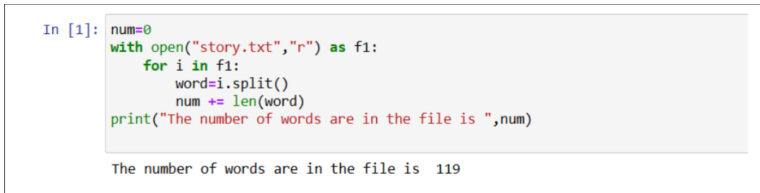

# Word-Count
## AIM:
To write a python program for getting the word count from a text.
## EQUIPEMENT'S REQUIRED: 
PC
Anaconda - Python 3.7
## ALGORITHM: 
### Step 1:
Import numpy as np
### Step 2: 
Enter the input values 
### Step 3: 
Write python program for getting the word count from the contents of a file using command line arguments
### Step 4:  
Run the program
### Step 5: 
Input the values
### Step 6: 
End the program
## PROGRAM:
```
#To write a python program for reading content from a CSV file.
#Developed by: LAVANYA S
#Register Number: 212223230112

import pandas as pd
df = pd.read_csv('nba.csv')
print(df.head(10))
print(df.tail())
print("Number of rows:",len(df.axes[0]))
print("Number of columns:",len(df.axes[1]))
```

### OUTPUT:



## RESULT:
Thus the program is written to find the word count from a text.
